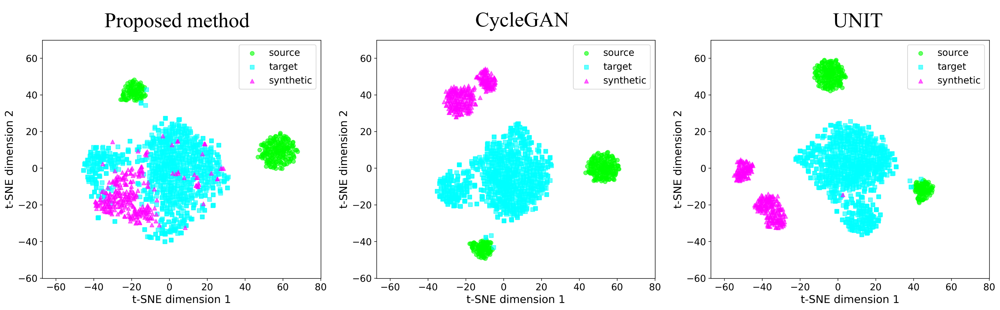

# Style-Injected-CycleGAN
master thesis
## 介紹
> 為了解決植物病害辨識中的資料稀缺和類別不平衡問題，本團隊提出了一個端到端的合成與擴增流程。此流程的核心是一個新穎的風格注入循環一致生成對抗網路(SI-CycleGAN)，搭配風格採樣器。這個組合能從極少數的真實樣本中提取並多樣化病害特徵，從健康葉片生成大量高品質的合成病害葉片影像。


## 主要貢獻
- 解決農業病害識別中訓練資料有限和類別不平衡的問題。
- 開發一個合成框架，從最少的樣本創建多樣化的病害葉片影像。
- 建立一個完整的流程，整合合成資料生成與下游分類任務。
- 在資料受限的情況下，大幅縮小與最佳條件之間的效能差距。

## 功能展示
> 輸入影像 Real A 轉換為 Fake B，其中提取了 Real B 的風格，而 Real B 則被轉換為 Fake A，對應 Real A 的風格。完成了從健康葉片到細菌性斑點病、以及從細菌性斑點病到健康葉片的非配對影像對影像轉換。
> 


## 模型架構
> SI-CycleGAN 由風格編碼器 $SE$、生成器 $G$、鑑別器 $D$ 組成，並利用凍結的預訓練的 VGG-19 特徵萃取器進行感知損失計算。風格轉換主要透過 AdaIN 技術於生成器的瓶頸層實現。


損失函數：
- 對抗損失
  - 透過訓練生成器產生欺騙鑑別器的圖像，同時訓練鑑別器區分真實圖像和生成的圖像，從而鼓勵生成真實的圖像。
- 循環一致性損失
  - 確保翻譯過程是可逆的，並透過要求從 $A$ 轉換到 $B$ 再轉換回 $A$ 的圖像恢復原始圖像來防止模式崩潰。
- 身分損失
  - 當目標風格與來源風格相符時，身分損失會保留原始影像，充當正規化項，在不需要改變風格時防止不必要的修改。
- 風格損失
  - 基於預訓練 VGG-19 特徵的風格損失函數透過比較特徵表示的 Gram matrix，確保產生的影像能夠捕捉目標風格特徵。
- 內容損失
  - 透過比較 VGG-19 網路中間層的特徵表示，在風格轉換過程中保留語意內容資訊。

## 安裝設置
> 開發環境：pytorch2.7.1-cuda12.6-cudnn8-devel

步驟：
1. 在終端機輸入
   ```sh
   git clone https://github.com/chouyunming/Style-Injected-CycleGAN.git
   ```
   完成後會出現 `Style-Injected-CycleGAN` 專案目錄
2. 進入專案目錄
   ```sh
   cd Style-Injected-CycleGAN
   ```
3. 安裝虛擬環境 （需先安裝 conda）
   ```sh
   conda env create -f environment.yaml
   ``` 
4. 啟動虛擬環境
   ```sh
   conda activate style_plant
   ```

## 訓練方式
步驟：
1. 將 config.py 內的 `SOURCE_DIR` 和 `TARGET_DIR` 更換為自己的訓練集路徑，其餘參數設定皆可於 config.py 直接修改
2. 在終端機輸入
   ```sh
   python main.py
   ```
3. 若欲批次執行訓練可修改 train.sh 內的設定，並在終端機輸入
   ```sh
   ./train.sh
   ```   

## 推理方式
步驟：
1. 將 config.py 內的 `INFERENCE_INPUT_DIR` 更換成欲轉換的健康葉片；`INFERENCE_TARGET_DIR` 更換為欲轉換的目標風格葉片
2. 將 config.py 內的 `INFERENCE_STYLE_MODE` 設置為欲使用的風格採樣模式
3. 將 config.py 內的 `INFERENCE_CHECKPOINT_DIR` 更換為欲推論的權重路徑
4. 將 config.py 內的 `INFERENCE_OUTPUT_DIR` 更換為欲保存推論結果的路徑
5. 在終端機輸入
   ```sh
   python inference.py
   ```

## 指標計算方式
步驟：
1. 將 config.py 內的 `METRICS_INPUT_DIR` 更換為欲計算指標的推論結果保存路徑
2. 將 config.py 內的 `METRICS_TARGET_DIR` 更換為推論結果欲計算的目標資料集路徑（預設為目標風格類別原始資料集）
3. 在終端機輸入
   ```sh
   python metrics.py
   ```
4. 指標計算結果會保存至 `METRICS_INPUT_DIR` 路徑中

## 實驗結果
1. 與基線模型的比較結果


2. 不同風格採樣模式的結果


## 風格轉換結果可視化

